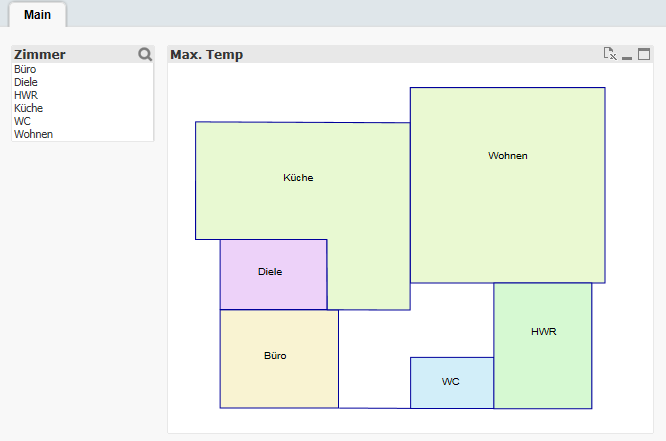
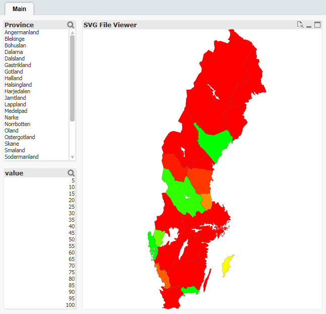

QlikView Extension svgFile
==========================

A simple extension to display an SVG file and use it with QlikView data. This has less features than svgMap extension but is probably more stable.

Properties:
-----------

1. Section ID: Dimensions, SVG ID to link the data, colors and popup to the SVG element or path
2. Measure: Measure to display
3. Color Expression: Color code for section, use Color, RGB or HSL function
4. Popup contens: Shows text from expression as popup on hovering
5. Load SVG File: filename of the SVG file, should be copied into the extension folder
6: SVG Path Prefix: to generate unique SVG element or path IDs this prefix will be replaced by Object ID (from container DIV), use this as prefix for all element IDs (with inkscape or else)
